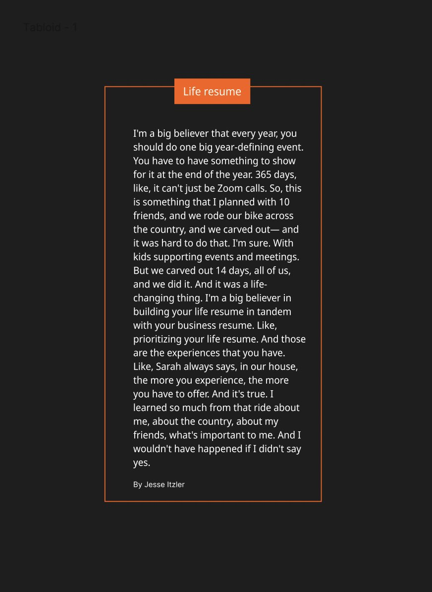

# 🔗 Stories/Finds/Writings

* [<mark style="color:green;">Pale Blue Dot - Carl Sagan</mark>](https://www.youtube.com/watch?v=wupToqz1e2g)
* [<mark style="color:green;">Frank Abagnale at Google</mark> ](https://www.youtube.com/watch?v=vsMydMDi3rI)
* [John McCain about Obama at 2008 Presidential rally](https://www.youtube.com/watch?v=JIjenjANqAk)
* [Blitzscaling 18 - Brian Chesky](https://www.youtube.com/watch?v=W608u6sBFpo)
* [<mark style="color:green;">Syam Pushkaran about his job</mark>](https://www.youtube.com/watch?v=9k5RU\_detl0)
* [a letter to myself](https://www.youtube.com/watch?v=JSIzFoopkWA)
* [Prithviraj in Nere Chowe -1 ||](https://www.youtube.com/watch?v=oi72\_HHDWY4) [Prithviraj in Nere Chowe -2](https://www.youtube.com/watch?v=rBA\_OWjrOyU)
* [<mark style="color:green;">Anxiously Yours - Rohan Joshi</mark>](https://www.youtube.com/watch?v=nXvQX3MNcmc)
* [<mark style="color:green;">Jack Dorsey at Startup School 2013</mark>](https://www.youtube.com/watch?v=wEQawgkCMOU\&t)
* [Rules - Nikita ](https://wiki.nikiv.dev/focusing/rules#life)
* [One small thing ](https://ava.substack.com/p/one-small-thing)
* [<mark style="color:green;">Steve Jobs on life</mark> ](https://www.youtube.com/watch?v=kYfNvmF0Bqw)
* [Focus is about saying no](https://www.youtube.com/watch?v=H8eP99neOVs)
* 
* [How to get unfairly lucky ](https://betterhumans.pub/how-to-get-unfairly-lucky-in-life-5843a353386b)
* [Tell people what you are working on ](https://medium.com/the-ascent/you-can-attract-luck-simply-by-telling-people-what-you-are-working-on-22819ffcd874)
* [The Harry Potter problem and Jeff Bezos bowing ](http://glinden.blogspot.com/2006/03/early-amazon-similarities.html)
* [Sriram Krishnan Memos ](https://sriramk.com/memos.html)
* [Stories by Deepu Pradeep ](http://deepu.me/)
* [<mark style="color:green;">How to Speak by Patrick Wilson</mark> ](https://www.youtube.com/watch?v=Unzc731iCUY\&list=PLoC2xDgOJZ64B9woZxNpr-yoCwPYTlS-6\&index=3\&t=1s)
* [History describes you.](https://www.youtube.com/watch?v=Vknhe2CbvmI\&feature=youtu.be)&#x20;
* [Look fear straight in its eyes ](https://www.youtube.com/watch?v=lPMH7OFrgL0)
* [Carl Pei <> Kunal Shah](https://www.youtube.com/watch?v=WsHt6-\_Pk40)&#x20;
* [Kailash <> Kunal Shah ](https://www.youtube.com/watch?v=99J0tQOV5ks)
* [Mind Expanding Books ](https://github.com/hackerkid/Mind-Expanding-Books#mind-expanding-books)
