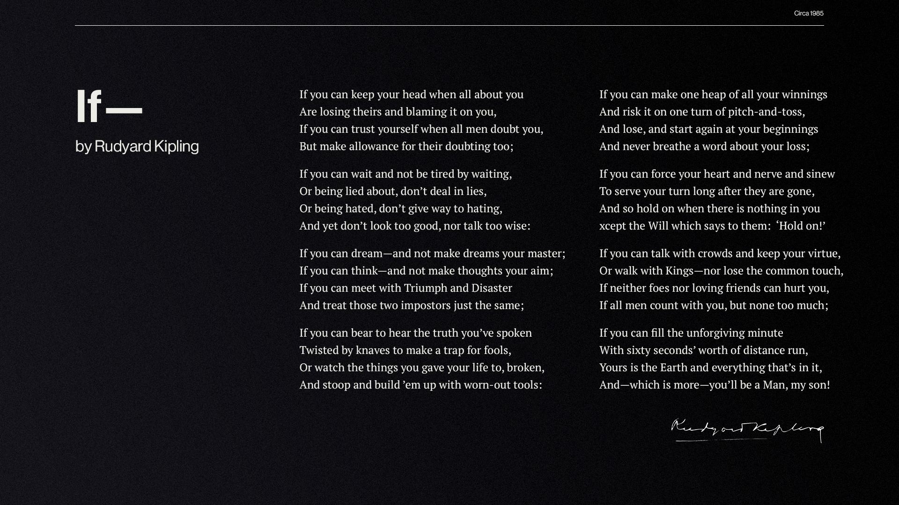

# 2023 October

October is also moving by fast.&#x20;

Went to the Techroast Show in Bangalore and it was brutal af and hilarious. I had a great time there.&#x20;

### Life&#x20;

What is worse than not being able to express all the love you have for someone? You care deeply for them, you will cross seas for them, but when you think you're expressing it, you're not.&#x20;

I wish there was an indicator or app for things like these.&#x20;

Why is this? Is this fear? Is this shielding yourself from being hurt by them? Of all the worst qualities a person can carry, not being able to show someone the love you have for them should be the worst.&#x20;


This scene is relatable especially for people who don’t know what it looks like when most of their lives is all about yelling, screaming, criticism, and low self worth. I cried because hearing her words it’s so beautiful but to people who don’t know that feeling of genuine love it’s so hard to accept that we deserve too and bear in this moment catastrophizes relationships and pushes away. Made me realize bear to me personally I am deserving of that.


### 26th October was a bad day. This poem helped.

<figure><figcaption></figcaption></figure>

### 29th October&#x20;

Matthew Perry passed away.

I am not the biggest FRIENDS fan out there, but it hurt.&#x20;

He taught me sarcasm and he was the most relatable and best character in FRIENDS for me.&#x20;

### About Love&#x20;

I hope you learn how to let go of a love that won’t love you back. I hope you have the courage to know when to end things, when to choose yourself, when to stand up for your heart. And I hope you have the courage to see endings as beautiful, transformative stepping stones. I hope you have the courage to let love and opportunity move through you like rain. To not grip, or seek to change it, to not beg for people or circumstances to be more than they can be for you. I hope you have the courage to see endings as the cornerstones of the chapters that changed you without needing them to be a part of the rest of your story.

I hope you have the courage to give yourself closure. To be your own home. To be your own safe place. I hope you have the courage to not let the losses destroy you, to not let them burrow into the heart of who you are and convince you that you failed, or that you are unworthy of having your heart chosen. I hope you have the courage to see the way in which you loved and tried and fought for something as a testament to just how deeply your capacity to feel is, just how beautiful moments can be when you appreciate them for what they were instead of nullifying them or letting them harden you to the world. Please, I hope you have the courage to move forward. I hope you have the courage to walk away with grace.

Because you deserve good love. You deserve to find the kind of love that makes you a softer person. The kind of love that makes you want to be a better human being, the kind of love that believes in you and supports you, that stands by your side. You deserve to find someone who quickly becomes your favourite thing – someone who makes the fall less fearful, someone you can't help but choose every single day. You deserve to find someone who shows you just how deeply you can feel, just how deeply you can love. You deserve to find something real — because nothing is more beautiful than loving someone who loves you back. Nothing is more beautiful than loving someone who builds you a home in their heart

[https://www.instagram.com/p/CnuMCYcqH9M/](https://www.instagram.com/p/CnuMCYcqH9M/)

### Listened&#x20;


This song was on loop. ❤️


* Baawre from Luck by Chance is stuck in my mind&#x20;
* Badass from Leo&#x20;
* Loki vintage playlist&#x20;

### Watched

* Delhi Belly&#x20;
  * How the fuck did I miss out on this. DB is an absolute goat. Satisfied.&#x20;
* Luck by Chance&#x20;
  * nice. nice. nice&#x20;
  * Konkana + Mumbai = ❤️
* Leo
  * It was kind of nice but I expected a lot
  * A bit more time in the writing would have made the movie dope&#x20;
  * LCU connection feels forced af.&#x20;
* I watched a shit ton of movies during a long weekend&#x20;
  * Rakshadikari Baiju&#x20;
  * Collateral
  * &#x20;Magnolia
  * 8 MM
  * Julie and Julia&#x20;
  * Under the banner of heaven&#x20;
  * The outfit
  * About Time&#x20;
  * Along Came Polly&#x20;
* Killer of the flower moon&#x20;

### Reading

* Turn the Ship Around&#x20;
* The Score Takes Care of Itself&#x20;
* Radical Candor&#x20;
* Super Thinking&#x20;

### General

* Starting taking notes extensively&#x20;
  * I am becoming more concerned about forgetting things as a lot of information is out there and I am consuming a lot.&#x20;
  * Taking extensive notes, storing it, and referring to it occasionally is I guess the only way for me to tackle that fear. Doing that.&#x20;
  * I also want to write and share this information so that others can use this and I can evolve based on that feedback as well. It is a positive sum game after all.&#x20;



