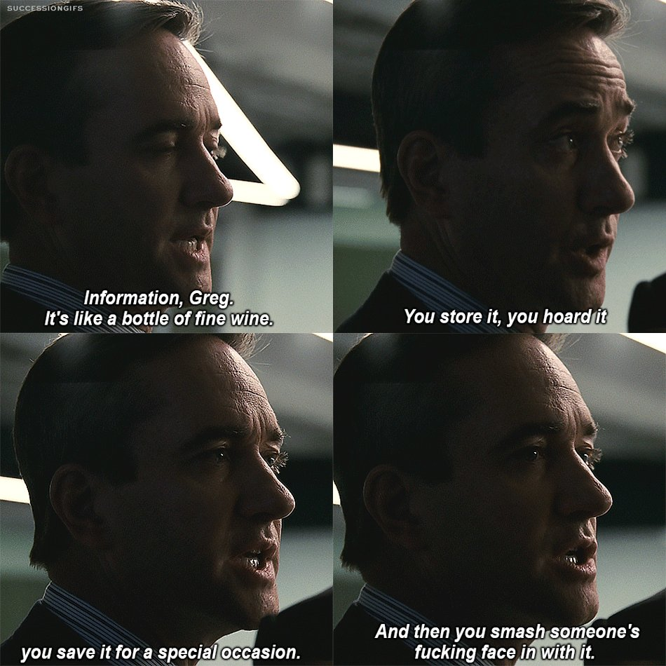

# 2025 November

### notes&#x20;

November was a good month.&#x20;

I parallely wrote apple notes whenever a thought that should be in the wiki striked.&#x20;

I have been reading let my people go surfing, and this book might very well become my bible.&#x20;

I want to go surfing. Planning for next year. starting with varkala.

I feel like I am not capturing everything in these docs, there are many missing links. Maybe that is the whole point.&#x20;

Maybe I need to journal as well. A private one. Maybe my kids can read it in the future. It will be cool like - The half blood prince. I want my kids to discover everything - spotify playlist, hevy, letterboxd, this wiki. They can slowly unravel different layers on me.&#x20;

I saw white birds flying in the pink sky.

<figure><figcaption></figcaption></figure>

Stumbled on an old mail to Kailash. Wow! Life can definitely surprise you.

<figure><figcaption></figcaption></figure>

{% embed url="https://www.instagram.com/p/DQuZTpwgDqo/?img_index=6&igsh=MTdwYjQ3OHM1aXZlMQ%3D%3D" %}

Edinburg is also on my list :)&#x20;

Got a Watergame, damn it is nostalgic. It is fun to do things I did as a kid.

<figure><figcaption></figcaption></figure>

Came to know about the equator crossing ceremony. It is fun and weird.&#x20;

<figure><figcaption></figcaption></figure>

Started watching pluribus - it is a killer show, I am slowly developing my attention span back with it.&#x20;

Watched point break - yes, I definetly want to surf.&#x20;

Started a Keep Going Folder&#x20;


[keep-going.md](../../../things-to-live-by/keep-going.md)


Lee Kuan Yew is an amazing personality. Went into a rabbit hole about him.&#x20;

Went for standup paddle - it was a whole lot of fun. I am proud of myself for choosing new experiences.&#x20;

The whole gravity hypothesis, put Deepinder Goyal into a different light for me.&#x20;

JC is one the people, I will trust when it comes to data backed opinions and suggestions on health.&#x20;



Tried showering in the gym itself and then leaving to office. Man it saves a hell lot of time :)&#x20;

Visit trandal in norway

Visit Lago de braies, dolomites

I loved listening to Bahul Ramesh talk. Learning to articulate and be honest in the same way.&#x20;



#### Rules for myself&#x20;

Read things or atleast get the gist before adding it to bookmarks or readwise

When it comes to health, there is no magic recipe - it is the same old things. Eat good, eat less. move. lift weights. Drink water. Sleep for the right amount of time. Socialise. Talk to people openly. Don't bottle up feelings. **The only secret is plain old consistency in all of these.**&#x20;

### read.









{% embed url="https://www.instagram.com/p/DQwFFvKD9j-/?utm_source=ig_web_copy_link&igsh=NTc4MTIwNjQ2YQ%3D%3D&img_index=8" %}





### watched.&#x20;

Local Hero.&#x20;

I went into this movie with 0 expectations or idea and came out a changed person. I might go back and watch it again. The music is soulful.&#x20;

I want to visit Aberdeen one day.&#x20;





### Quotes&#x20;

**I've always thought of myself as an 80 percenter. I like to throw myself passionately into a sport or activity until I reach about an 80 percent proficiency level. To go beyond that requires an obsession that doesn't appeal to me. - Yvon**

"Real adventure is defined best as a journey from which you may not come back alive, and certainly not as the same person." \~ Yvon Chouinard

"There's a movement for simplifying your life: purchase less stuff, own a few things that are very high quality that last a long time, and that are multifunctional." \~ Yvon Chouinard AG

I spent a year backpacking around the world. The night before I left, I was nervous. Anxious about the unknown.

My roommate told me to apply “The Rocking Chair Test”. He asked, “when you’re 99 years old, sitting in your rocking chair and looking back on your life, are you going to regret traveling the world”

That year turned out to be the most valuable time of my life.

**Repetition doesn’t create memories. New experiences do. Our perception of time is really driven by our perception of the unfamiliar, vivid and new. Of course, it turns out time slows down the most during life threatening experiences. \[1] A safer way to slow down time is to travel. Travel is a new experience that can transport you out of your everyday routine to create memories with the ones you love.**

**As we enter the holiday season I hope you get a chance to spend time with the people you care about. And if you can, travel with them.**

**There is an old saying that “life is a journey.” In fact, life is many journeys. The more of them you take, the longer it will seem.**

“Our greatest weapon against stress is our ability to choose one thought over another.” 

"To use mathematics effectively in applications, you need not just knowledge but skill .  Skill can only be obtained through practice.", from Mary Boas in "To The Student" of her "Mathematical Methods in the Physical Sciences".  This is true for both applied (computational-oriented) and pure (theorem-proof oriented) courses.  I'm in my 20's (for the third time) and still work through the derivations, examples and solve problems to really "get it".

"Work hard, if you really have to.

But know why you’re working hard. And keep re-evaluating those reasons from time to time.

Fetishization of hard work creates toxic culture, and robs humanity of everything that’s important for a happy life - health, play and relationships."
