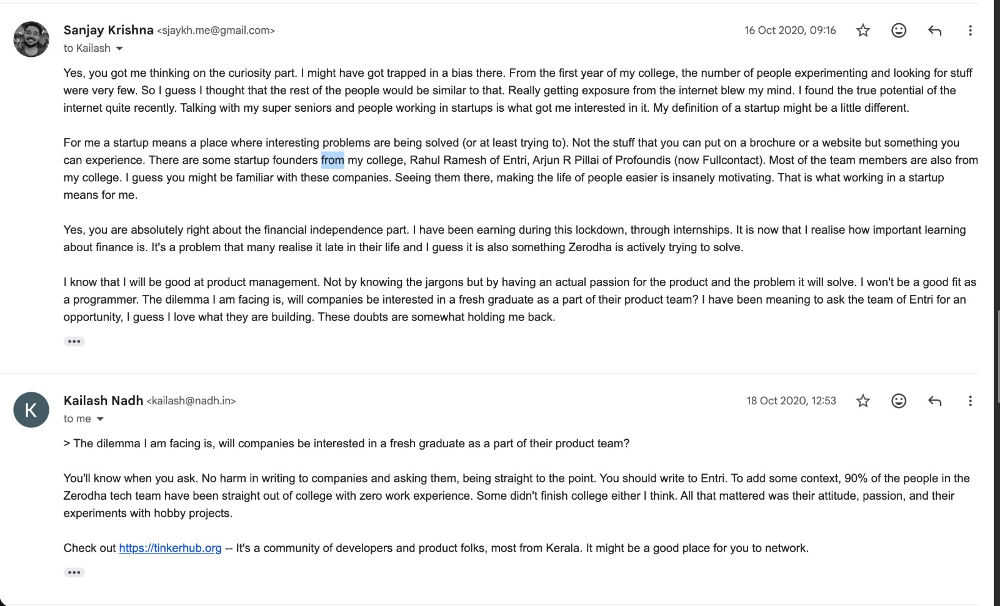

# 2025 October

### Notes&#x20;

* Watching the Technicians Roundtable on Cue was insightful.&#x20;
  * Creating movies are difficult.&#x20;



* Met C Balagopal, the conversations was great!
* Looks like Apple Watch is my best puchase of the year.&#x20;
  * Thinking of upgrading to Apple Watch 11
* Gym is going great :)&#x20;
  *

      <figure><figcaption></figcaption></figure>

* I want to learn swimming and surfing.&#x20;
* Have been getting worried about health and diseseas.&#x20;

### Reading&#x20;

Continuing to read "Let My People Go Surfing"&#x20;







### Quotes

* “The biggest heartbreak wasn’t watching the system fail good people; it was watching some of those same people get reshaped by it. They began to mirror the very patterns they once recognized and resisted, because that was the model of “leadership” around them.”
