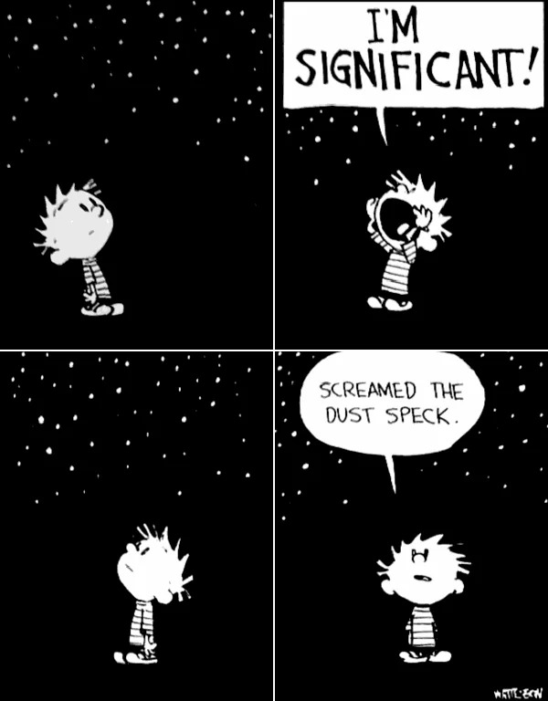
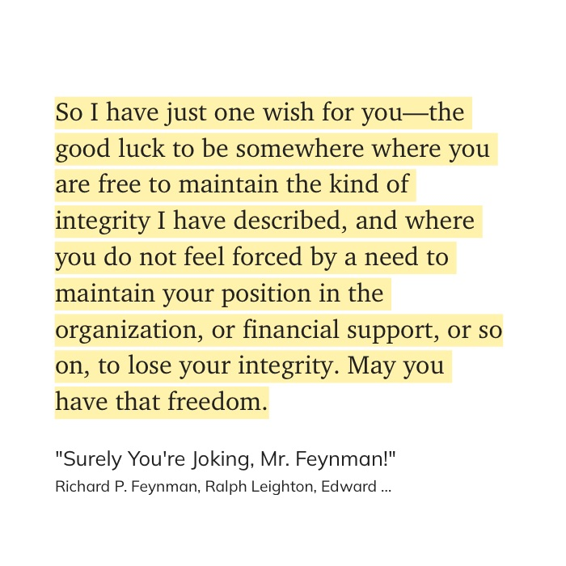

# 2026 - May, June, July

Well these months went by fast.

Met Manu S Pillai.&#x20;

Got some gifts.&#x20;

Writing this on July 2nd and I can't recollect a lot of stuff, but time went by pretty quickly. Looking back there were some happy moments :)&#x20;

Workouts have been going great, but I need to cut fat. I have been slacking there on the food stuff.&#x20;

Read 'East of Eden' - it was long af but the story was great :)&#x20;

<figure><figcaption></figcaption></figure>

I got a 5 year journal.&#x20;

Good a food poisoning scare somewhere in June, and it sucked.&#x20;

Read persepolis.&#x20;

Watched Sheep Detective.&#x20;

Started cooking, it is going great but on somedays I mess up.&#x20;

<figure><figcaption></figcaption></figure>

That's pretty much covers it up. I dunno.&#x20;

I want to shift to a new place, the place is idetinfied and sorted. Need a change and to live alone.&#x20;

<figure><figcaption></figcaption></figure>

Yeah, I think I am running from a lot of stuff and is constantly being distracted by a lot of things. Well on to July then.&#x20;
